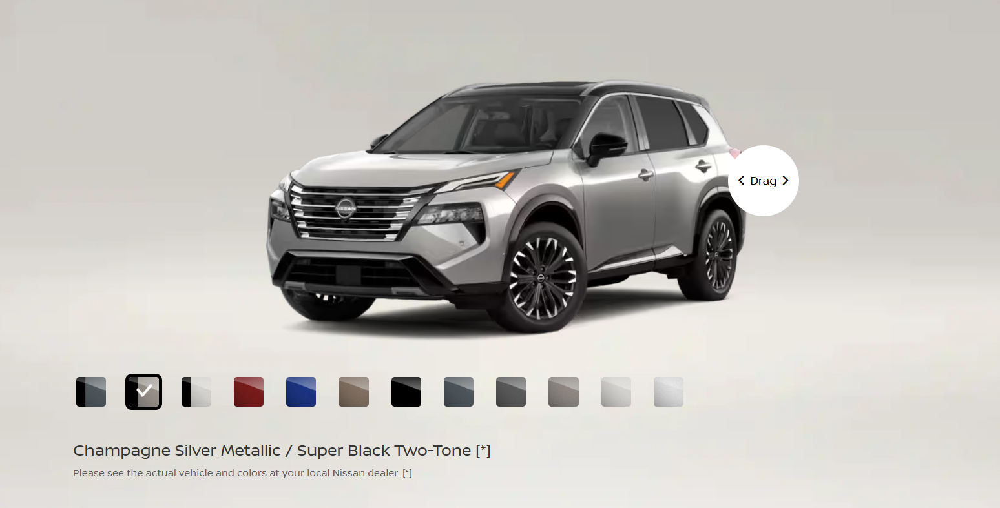
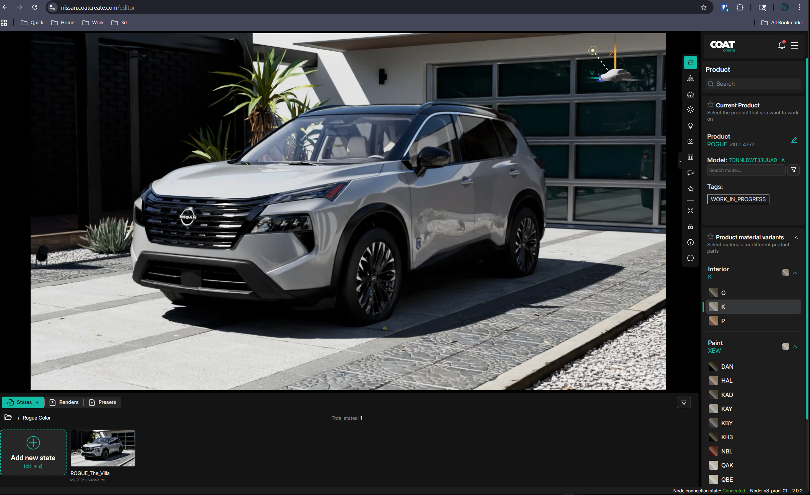

# 

## The problem

Colors dont look "right" 

Example color from website:

Example photo:

Example working in COAT:

Other Problems include, White paints being blown out and black colors having no diffuse. 

# Color Checker

https://github.com/colour-science/colour-nuke/tree/master/colour_nuke/resources/images/ColorChecker2014

# HDRI

https://polyhaven.com/a/studio_small_09